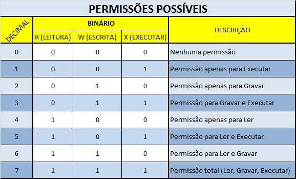

# Atividade-Chamadas-de-sistemas
Atividade da disciplina de sistemas operacionais.

## date
O comando date depende de chamadas de sistema para obter a hora atual. Normalmente, ele faz uso da função gettimeofday() ou clock_gettime(), que são chamadas de sistema responsáveis por obter o tempo atual do sistema. Essas chamadas de sistema acessam um contador de tempo de hardware mantido pelo shell do Linux.

A função que eu utilizo é a clock_gettime(), ela permite que sistema acesse um relógio específico, como o relógio de tempo real (CLOCK_REALTIME), que fornece o tempo do sistema em relação ao Unix Epoch (00:00:00 UTC em 1 de janeiro de 1970), com precisão em nanossegundos. 

## uptime

A chamada de sistema uptime é utilizada para obter informações sobre o tempo de atividade do sistema operacional. Quando você executa o comando uptime no shell do linux, ele mostra o tempo que o sistema está funcionando, bem como outras informações relevantes, como o número de usuários logados e a carga média do sistema nos últimos 1, 5 e 15 minutos.

Internamente, a chamada de sistema uptime obtém essas informações consultando o arquivo /proc/uptime. Este arquivo contém dois números separados por um espaço em branco: o primeiro número representa o tempo em segundos desde que o sistema foi inicializado, e o segundo número representa o tempo que o sistema passou em estado ocioso.

Este comando faz a utilização de buffer no código, para poder armazenar o texto que deve ser mostrado nas horas, já que elas vem do arquivo proc/.

## ls

O comando ls abre um programa que usa chamadas de sistema do Linux para interagir com o sistema de arquivos e listar o conteúdo de um diretório específico.

Para listar os conteúdos de um diretório, o programa ls pode usar várias chamadas de sistema do Linux, como opendir(), readdir() e closedir() para abrir, ler e fechar diretórios, respectivamente. Ele também pode usar chamadas de sistema de obtenção de atributos de arquivos, como stat() ou lstat(), para obter informações sobre os arquivos no diretório.

## cp

O comando cp no Linux é utilizado para copiar arquivos e diretórios de um local para outro. Ele oferece uma série de opções para controlar o comportamento da cópia, como preservar atributos de arquivos, recursivamente copiar diretórios, forçar a sobrescrita de arquivos existentes, entre outros.

O código feito neste trabalho, foca somente em sua função principal, a de copiar um arquivo ou diretorio, utilizando chamadas de sistema do Linux (open(), read(), write(), close()) para manipulação de arquivos. 

Este comando também faz a utilização de buffer no código, para poder armazenar os caracteres do arquivo que deverá ser copiado.

## rm 

O comando rm no Linux é usado para remover (ou excluir) arquivos e diretórios. Ele tem várias opções para personalizar o comportamento da remoção, como a capacidade de remover recursivamente diretórios e forçar a remoção sem solicitar confirmação.

O código feito neste trabalho, foca somente em sua função principal, a de remover arquivos, utilzando a chamada de sistema unlink() que é a responsável pela funcionalidade de remoção de arquivos no comando rm, com verificações de permissões, manipulação de arquivos e atualizações do sistema de arquivos realizadas conforme necessário para garantir que a remoção ocorra corretamente. A chamada de sistema unlink() é uma operação de baixo nível que remove um link para um arquivo ou diretório no sistema de arquivos. Se o link removido for o último link para o arquivo ou diretório, o espaço no sistema de arquivos associado a esse arquivo ou diretório é liberado.

## mv
O comando mv é uma ferramenta que serve para mover e renomear arquivos e diretórios no sistema de arquivos do Linux, proporcionando flexibilidade e facilidade de uso para reorganizar os dados no sistema.

O código feito neste trabalho, utiliza a chamada de sistema rename(), ela é usada para renomear um arquivo, movê-lo para um novo diretório ou ambos. 

## cat
O comando cat é usado principalmente para exibir o conteúdo de arquivos de texto no shell do sistema Unix e Linux. O cat é uma ferramenta simples, mas poderosa, que possui várias funcionalidades úteis. 

O comando cat no Unix e no Linux usa principalmente a chamada de sistema open(), read() e write() para manipular arquivos e imprimir seu conteúdo no shell. No código feito para este trabalho, a chamada de sistema write é substituida pelo printf().

Este comando também faz a utilização de buffer no código, para poder armazenar o texto do arquivo que deve ser mostrado.

## mkdir

O comando mkdir no sistema operacional Linux é utilizado para criar diretórios (pastas) no sistema de arquivos. Ele recebe como argumento o nome do diretório que se deseja criar.

A chamada de sistema usada pelo comando mkdir é a mkdir(), que é a mesma utilizada pelo código neste trabalho, a função dela é de criar um novo diretório, além disso, o valor retornado por ela é 0 em caso de sucesso e -1 em caso de falha, e o código de erro é definido na variável errno do linux.

No uso da chamada de sistema no código, se é passado como parametro o número 0777, que é uma representação octal de permissões de acesso em sistemas Unix. É uma forma de especificar permissões de leitura, escrita e execução para o arquivo ou diretório que está sendo criado.

## rmdir

O comando rmdir é um comando em sistemas Unix e Linux que é usada para remover um diretório vazio do sistema de arquivos. O diretório especificado deve estar vazio para que a remoção seja bem-sucedida. Se o diretório contiver arquivos ou outros diretórios, o comando rmdir falhará.

O comando usa a chamada de sistema rmdir() para remover o diretório especificado. A chamada de sistema rmdir() é responsável por verificar as permissões de acesso, verificar se o diretório está vazio, remover o diretório e retornar um valor para indicar o resultado da operação. Essa chamada de sistema desempenha um papel crucial na manipulação de diretórios vazios no sistema de arquivos do sistema operacional.

## chmod

O comando chmod tem a função de alterar a permissão de um arquivo/diretório, ele utiliza do chmod() que é uma chamada de sistema que é usada para alterar as permissões de acesso de um arquivo ou diretório no sistema operacional Linux. A palavra "chmod" é uma abreviação de "change mode".

Quando falamos em change mode, falamos de uma mudança de modo em octal, e que estão classificada em 3 níveis diferentes, que envolvem os usuário:

#### Usuário proprietário do arquivo ou diretório:
Na maioria das vezes foi quem o criou, mas pode receber essa atribuição pelo root.
#
#### Grupo do proprietário do arquivo ou diretório:
É o grupo que categoriza os usuários do mesmo grupo de quem criou o arquivo ou diretório, mas pode ser alterado pelo root..
#
#### Outros usuários:
São qualquer outro que não o próprio usuário proprietário ou membro do grupo do proprietário.
#
#### Para cada um destes níveis, existem três tipos de permissões:

<li>
    r – para leitura.
</li>
<li>
    w – para escrita ou gravação.
</li>
<li>
    x – para exceção, no caso de se tratar de um script ou binário executável.
</li>

#### Método octal
O método octal é uma representação das permissões no nível binário e esta forma de administração funciona através da soma de valores. Os valores são:

<li>
    r – 4
</li>
<li>
    w – 2
</li>
<li>
    x – 1
</li>

São representados em ordem decrescente. A soma de todos representa o nível mais alto de permissão: 7. Isso diz ser possível ler, gravar e executar, ou seja, todas possibilidades. Esta é uma tabela que contém todas as possíveis combinações:

Utilizando essas combinações no codigo octal que decidimos quais permissões serão dadas ao arquivo ou a pasta.